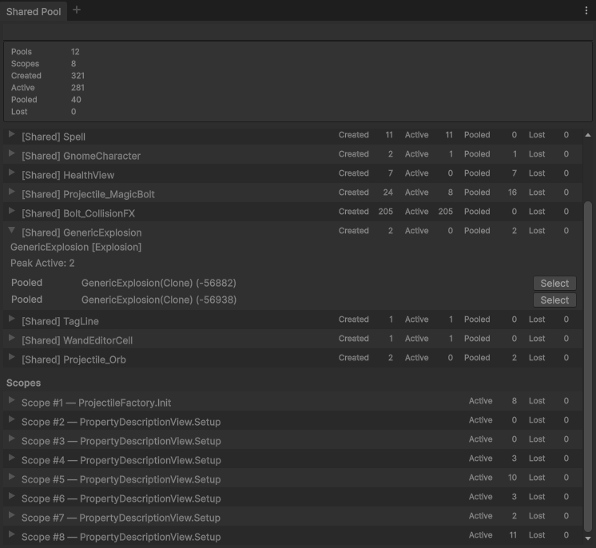

# Pools

**Pools** is unity specific set of components and tools, which allows easy work with component-based pooling.
It includes
- `ObjectPool` as generic base pool implementation
- `ComponentPool` as a wrapper of `ObjectPool` with Unity components specifics
- `SharedPool` as primary system of centralized pools implementing lifecycle control, scopes, custom pools' handles, control of broken references etc. See below for more details.

# Reasons to exist

A generic pool implementation is fine as a pattern implementation, as well as the basic implementation provided by Unity with UnityEngine.Pool.
But Unity as an engine introduces a bunch of edge cases which are good to handle in a centralized way:

1. `GameObject` destroying and zombie objects. Unity overrides the == operator, so a managed shell object may still exist in memory even though the actual engine object has already been destroyed.
2. `GameObject` not being a `Component`, unlike every other entity related to game objects.
3. One-to-many relationships between `GameObject` and components, which makes identifying the actual pooled instance less trivial than just passing a GameObject around.
4. Hierarchy and `GameObject` built-in lifecycle calls, including control over the order of Get/Release, SetActive, parenting, transform reset, and spawn/release callbacks.
5. Decoupling through self-releasing objects. VFX is a perfect example: the effect can return itself to the pool without introducing dependencies on the system that spawned it or requiring extra infrastructure.
6. UGUI relies on `GameObject` and is tricky to pool across different screens/popups. Local pools are suboptimal, shared pool is an easy plug-in for such cases.
7. Debug and diagnostics. Considering fragile nature of referencing to GameObject, it is very easy to miss leaking pools and even worse, to get unpredictable behaviour with zombie objects.
8. TBD: analytics on pool capacity usage over time, memory pressure control and dynamic resizing, generations

# Installation

Install via the Package Manager window by using [GitHub URL](https://docs.unity3d.com/Manual/upm-git.html). Press the Add button in the Package Manager window and enter the following URL:

`https://github.com/oleg-pshenin/com.op.framework.pools.git#v0.1.0`

or for latest version

`https://github.com/oleg-pshenin/com.op.framework.pools.git`

## SharedPool public structure

### SharedPool

The default entry point. `Get` reuses or creates an instance for the requested prefab/component type, while `Release` returns the active instance to its backing pool.

Shared pools live for the lifetime of the `SharedPool` component and are reused across callers.

```csharp
var vfx = SharedPool.Get(vfxPrefab);
SharedPool.Release(vfx);
```

### PoolScope

`PoolScope` does not create a separate pool. It tracks ownership of instances taken from shared pools and can release all instances associated with that scope at once.

Disposing a scope releases its remaining instances and marks the scope as disposed, allowing to skip tracking of instances.

```csharp
var scope = SharedPool.CreateScope("Match");

foreach (var projectilePrefab in projectilePrefabs)
{
    scope.Get(projectilePrefab);
}

// on match end
scope.Dispose();
```

### PoolHandle

`PoolHandle<T>` owns a dedicated pool entry for one prefab/component type.

It is useful when a system needs an isolated pool with single owne, its own lifetime and initialization callback. Disposing the handle releases its instances and destroys its pool root.

```csharp
using var handle = SharedPool.CreateHandle(projectilePrefab, projectile => projectile.Init(), "Projectiles");
var projectile = handle.Get();
```

## SharedPool internal structure

### PoolEntry

`PoolEntry<T>` is the internal bridge between `SharedPool` and `ComponentPool<T>`.

Each entry owns one backing component pool, registers active instances with `SharedPool`, and forwards `Get`, `Release`, `Prewarm`, and disposal operations.

Shared entries are reused by prefab. Handle entries are isolated and disposed together with their handle.

### Lifecycle

Shared entry lives with `SharedPool` and is reused by prefab:

```text
Get(prefab) → Shared Entry → Pooled ⇄ Active
Release(instance) → Active → Pooled
```

Scope only adds ownership over active instances from shared entries:

```text
Scope.Get(prefab) → Shared Entry → Pooled → Active + Scope ownership
Scope.Release / ReleaseAll / Dispose → Active → Pooled
```

Disposing a scope does not destroy the shared entry or its pooled instances.

Handle owns a dedicated entry, pool root, and lifetime:

```text
CreateHandle(prefab) → Dedicated Entry → Pooled ⇄ Active
Handle.ReleaseAll() → Active → Pooled
Handle.Dispose() → Entry disposed + Root destroyed + pooled instances destroyed
```

Destroying instances outside the pool breaks the lifecycle:

```text
Active → Destroy() → LostActive
Pooled → Destroy() → LostPooled
```

`SharedPool` owns lifecycle and ownership validation. Lower pool layers only manage storage and Unity component mechanics.

### GameObject mapping

`SharedPool` keeps a mapping between an active pooled `Component` and its `GameObject`.

This allows:

```csharp
SharedPool.Get(vfxPrefab);

// Inside self-releasing component of created instance wihtout external control
SharedPool.Release(this.gameObject);
```

to release the actual pooled component even when the pool was created for something other than `Transform` (`Transform` is garaunteed to be one-to-one to `GameObject`).

The mapping also prevents one active `GameObject` from ambiguously representing multiple pooled component instances.

## Diagnostics

Editor diagnostics tracks:

- shared and handle pool entries;
- created, active, pooled, and peak-active counts;
- active scopes;
- lost active and pooled Unity objects;
- optional debug names and caller metadata for scopes and handles.

The debugger is editor-only and does not affect pool behaviour. **Depends on Odin Inspector** at the moment.


